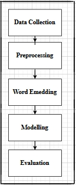
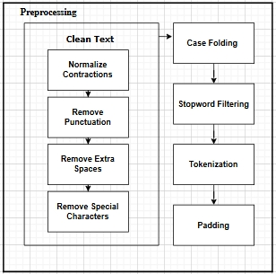
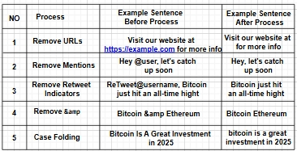
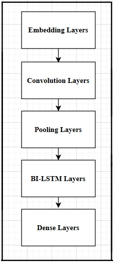
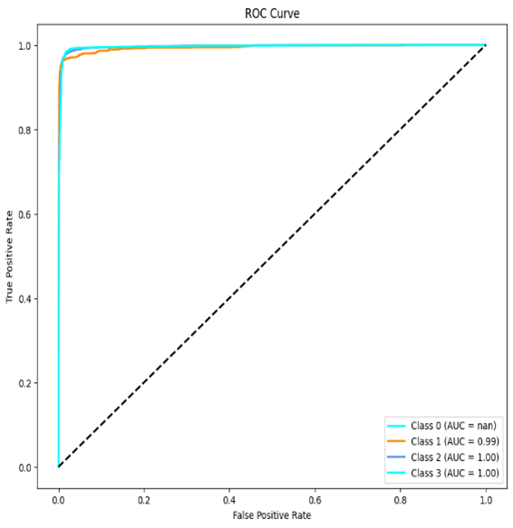
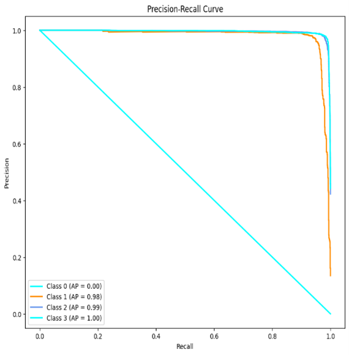
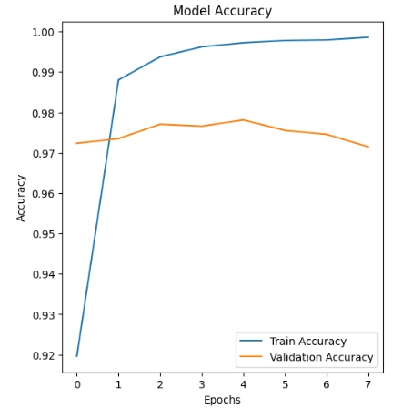
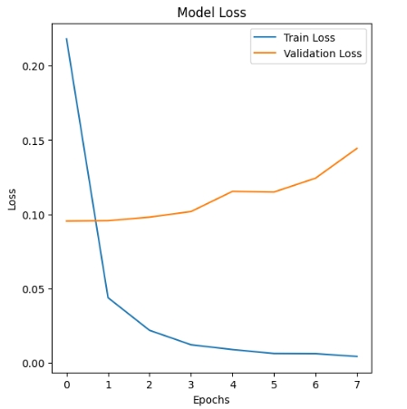
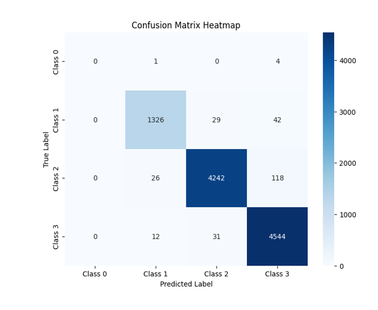

# 📌 Sentiment Analysis of Text Using CNN-BiLSTM

This project implements a **hybrid Convolutional Neural Network (CNN) and Bidirectional Long Short-Term Memory (Bi-LSTM)** model for **sentiment analysis** of textual data (Twitter dataset).  
The hybrid approach leverages:
- **CNN** → for extracting local word patterns  
- **Bi-LSTM** → for capturing long-term dependencies and contextual meaning  

The model achieves **91.5% accuracy** and a **89.86% weighted F1-score**, making it highly effective for classifying tweets as **Positive, Neutral, or Negative**.

---

## ✨ Features
- Data preprocessing pipeline (cleaning, tokenization, stop-word removal, padding)  
- Word embedding using TensorFlow/Keras  
- Hybrid **CNN + Bi-LSTM** architecture  
- Evaluated with **ROC-AUC, Precision-Recall, Confusion Matrix, Accuracy/Loss plots**  
- Achieved:
  - ✅ Accuracy: **91.5%**
  - ✅ Weighted F1-score: **89.86%**
  - ✅ AUC ≈ **0.91** for Positive & Neutral sentiments

---

---

## ⚙️ Methodology

### 🔹 Data Collection
- 50,000 tweets obtained from Kaggle  
- Sentiment labels: **Positive, Negative, Neutral**

  

---

### 🔹 Preprocessing
- Remove noise (URLs, hashtags, special chars)  
- Case folding (convert to lowercase)  
- Stop-word removal (using NLTK)  
- Tokenization & sequence padding (Keras)

  

  

---

### 🔹 Word Embedding
- Convert tokens into dense numerical vectors using **Keras Embedding Layer**

---

### 🔹 Modeling
- **CNN layers** → Extract local text patterns  
- **Bi-LSTM layers** → Capture sequence dependencies (forward & backward)  
- **Dense + Softmax layer** → Classify into sentiment categories  

  

---

### 🔹 Evaluation Metrics
- Confusion Matrix  
- ROC-AUC Curve  
- Precision-Recall Curve  
- Accuracy & Loss plots  

---

## 📊 Results

### 🔹 ROC Curve

  

---

### 🔹 Precision-Recall Curve

  

---

### 🔹 Training & Validation Accuracy

  

---

### 🔹 Training & Validation Loss

  

---

### 🔹 Confusion Matrix

  

---

### ✅ Performance Summary
- **Overall Accuracy**: **91.5%**  
- **Weighted F1-score**: **89.86%**
- 
| Class    | Precision | Recall | F1-Score |
| -------- | --------- | ------ | -------- |
| Negative | 0.89      | 0.88   | 0.90     |
| Neutral  | 0.91      | 0.90   | 0.89     |
| Positive | 0.91      | 0.89   | 0.90     |

- ROC-AUC ≈ **0.91**  
- Validation accuracy stabilized at **91.5%**  
- Overall F1-score **~89.86%**  

---

